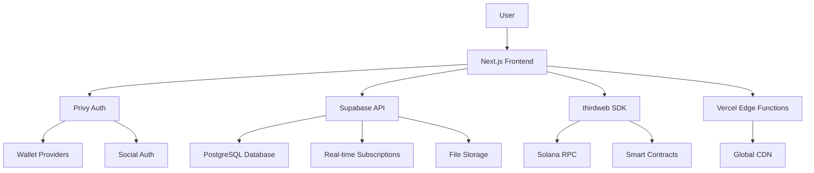

# Technical Architecture

## Overview

builda.club is built on a modern, battle-tested tech stack designed for speed, scalability, and developer experience. Our architecture enables rapid development while maintaining the security and reliability required for handling real money and valuable community assets.

## The BUIDL Stack

### 🔐 Authentication & Wallets - Privy

**Why Privy?**
- Seamless Web2 + Web3 authentication
- Progressive disclosure (crypto when ready)
- Embedded wallets for non-crypto users
- Social login integration

**Features:**
- **Wallets**: Phantom, Solflare, Backpack support
- **Social Auth**: Google, Discord, Twitter login
- **Embedded Wallets**: Auto-generated for email users
- **Progressive**: Hide crypto complexity until needed

**Implementation:**
```typescript
import { PrivyProvider } from '@privy-io/react-auth';

const App = () => (
  <PrivyProvider
    appId={process.env.NEXT_PUBLIC_PRIVY_APP_ID}
    config={{
      loginMethods: ['email', 'wallet', 'google', 'discord'],
      appearance: {
        theme: 'light',
        accentColor: '#676FFF',
      },
    }}
  >
    <YourApp />
  </PrivyProvider>
);
```

### 💾 Database & Real-time - Supabase

**Why Supabase?**
- PostgreSQL with real-time subscriptions
- Built-in authentication and row-level security
- Global edge functions
- Integrated file storage

**Database Schema:**
```sql
-- Core tables
CREATE TABLE clubs (
  id UUID PRIMARY KEY DEFAULT gen_random_uuid(),
  name TEXT NOT NULL,
  description TEXT,
  treasury_balance DECIMAL(18,2) DEFAULT 0,
  token_address TEXT,
  created_at TIMESTAMP DEFAULT NOW(),
  updated_at TIMESTAMP DEFAULT NOW()
);

CREATE TABLE members (
  id UUID PRIMARY KEY DEFAULT gen_random_uuid(),
  club_id UUID REFERENCES clubs(id),
  user_id TEXT NOT NULL, -- Privy user ID
  wallet_address TEXT,
  token_balance DECIMAL(18,2) DEFAULT 0,
  buidl_earned DECIMAL(18,2) DEFAULT 0,
  joined_at TIMESTAMP DEFAULT NOW()
);

CREATE TABLE contributions (
  id UUID PRIMARY KEY DEFAULT gen_random_uuid(),
  club_id UUID REFERENCES clubs(id),
  member_id UUID REFERENCES members(id),
  amount DECIMAL(18,2),
  type TEXT NOT NULL, -- 'treasury', 'value_add', 'governance'
  description TEXT,
  created_at TIMESTAMP DEFAULT NOW()
);
```

**Real-time Features:**
- Live treasury balance updates
- Member activity feeds
- Governance vote notifications
- Chat and collaboration tools

### ⛓️ Blockchain Infrastructure - thirdweb + Solana

**Why thirdweb + Solana?**
- Pre-built, audited smart contracts
- Gasless transactions via sponsored accounts
- TypeScript-first SDK
- Fastest and cheapest transactions

**Smart Contracts:**

1. **Club Token Contract** (Non-tradeable SPL Token)
```typescript
// Club token with transfer restrictions
export class ClubToken {
  async createClubToken(clubName: string, symbol: string) {
    const contract = await sdk.deployer.deployToken({
      name: clubName,
      symbol: symbol,
      // Disable transfers between wallets
      transferRestrictions: {
        allowTransfers: false,
        allowBurns: true
      }
    });
    return contract;
  }
}
```

2. **BUIDL Token Contract** (Platform token)
```typescript
// Platform-wide BUIDL token
export class BUIDLToken {
  async createBUIDLToken() {
    const contract = await sdk.deployer.deployToken({
      name: "BUIDL",
      symbol: "BUIDL",
      totalSupply: 1_000_000_000, // 1B fixed supply
      // Standard SPL token - tradeable
    });
    return contract;
  }
}
```

3. **Treasury Management**
```typescript
// Multi-sig treasury for each club
export class ClubTreasury {
  async createTreasury(clubId: string, members: string[]) {
    const contract = await sdk.deployer.deployMultisig({
      signers: members,
      threshold: Math.ceil(members.length * 0.6), // 60% threshold
    });
    return contract;
  }
}
```

### 🚀 Deployment - Vercel

**Why Vercel?**
- Created Next.js, perfect integration
- Global edge functions
- Automatic deployments
- Built-in analytics and monitoring

**Deployment Configuration:**
```json
{
  "buildCommand": "npm run build",
  "outputDirectory": ".next",
  "framework": "nextjs",
  "functions": {
    "app/api/**/*.ts": {
      "runtime": "nodejs18.x"
    }
  },
  "env": {
    "PRIVY_APP_ID": "@privy-app-id",
    "SUPABASE_URL": "@supabase-url",
    "SUPABASE_ANON_KEY": "@supabase-anon-key",
    "THIRDWEB_CLIENT_ID": "@thirdweb-client-id"
  }
}
```

## System Architecture

### High-Level Overview



### Data Flow

1. **User Authentication**
   - User connects via Privy (wallet or social)
   - Privy provides unified user ID
   - Supabase creates user profile

2. **Club Creation**
   - User initiates club creation
   - thirdweb deploys club token contract
   - Supabase creates club record
   - Treasury contract deployed

3. **Member Joining**
   - User contributes (USDC or fiat via Stripe)
   - Club tokens minted to user
   - Treasury balance updated
   - Real-time notifications sent

4. **Value Creation**
   - Members contribute value
   - $BUIDL rewards distributed
   - Activity tracked in Supabase
   - Smart contracts updated

## Security Considerations

### Authentication Security
- **Privy**: Industry-standard OAuth and wallet authentication
- **Supabase RLS**: Row-level security for data access
- **JWT Tokens**: Secure session management

### Smart Contract Security
- **thirdweb**: Audited, battle-tested contracts
- **Multi-sig**: Treasury requires multiple signatures
- **Access Control**: Role-based permissions
- **Upgradeability**: Controlled contract upgrades

### Data Security
- **Encryption**: All sensitive data encrypted at rest
- **HTTPS**: All communications encrypted in transit
- **Backup**: Automated database backups
- **Monitoring**: Real-time security monitoring

## Performance Optimizations

### Frontend
- **Next.js**: Server-side rendering and static generation
- **Vercel Edge**: Global CDN and edge functions
- **Image Optimization**: Automatic image optimization
- **Code Splitting**: Lazy loading for better performance

### Backend
- **Supabase**: Connection pooling and query optimization
- **Real-time**: Efficient WebSocket connections
- **Caching**: Redis for frequently accessed data
- **Database Indexing**: Optimized queries

### Blockchain
- **Solana**: Sub-second transaction finality
- **Gasless**: Sponsored transactions for better UX
- **Batch Operations**: Multiple operations in single transaction
- **RPC Optimization**: Multiple RPC providers for reliability

## Monitoring & Analytics

### Application Monitoring
- **Vercel Analytics**: Performance and usage metrics
- **Sentry**: Error tracking and performance monitoring
- **LogRocket**: User session recording and debugging

### Business Metrics
- **Custom Dashboard**: Real-time business metrics
- **Treasury Tracking**: Live treasury balances
- **User Analytics**: Engagement and retention metrics
- **Token Economics**: $BUIDL distribution and burning

## Development Workflow

### Local Development
```bash
# Clone repository
git clone https://github.com/buildaclub/platform
cd platform

# Install dependencies
npm install

# Set up environment variables
cp .env.example .env.local

# Start development server
npm run dev

# Run tests
npm test

# Build for production
npm run build
```

### Deployment Pipeline
1. **Code Push**: Git push to main branch
2. **Vercel Build**: Automatic build and deployment
3. **Database Migration**: Supabase migrations run
4. **Contract Deployment**: Smart contracts deployed if needed
5. **Health Checks**: Automated testing and monitoring

## Scalability Considerations

### Horizontal Scaling
- **Vercel**: Automatic scaling based on demand
- **Supabase**: Database connection pooling
- **CDN**: Global content delivery
- **Load Balancing**: Multiple RPC endpoints

### Vertical Scaling
- **Database**: Supabase Pro for higher limits
- **Storage**: Supabase storage scaling
- **Compute**: Vercel Pro for more resources
- **Blockchain**: Multiple Solana RPC providers

## Future Enhancements

### Phase 2 Improvements
- **Mobile App**: React Native mobile application
- **Advanced Analytics**: Machine learning insights
- **API Rate Limiting**: Advanced rate limiting
- **Multi-chain**: Support for additional blockchains

### Phase 3 Features
- **AI Integration**: AI-powered community insights
- **Advanced Governance**: Complex voting mechanisms
- **Cross-club Collaboration**: Inter-club partnerships
- **Enterprise Features**: Advanced admin controls

---

*This architecture document is living and will be updated as the platform evolves.*


